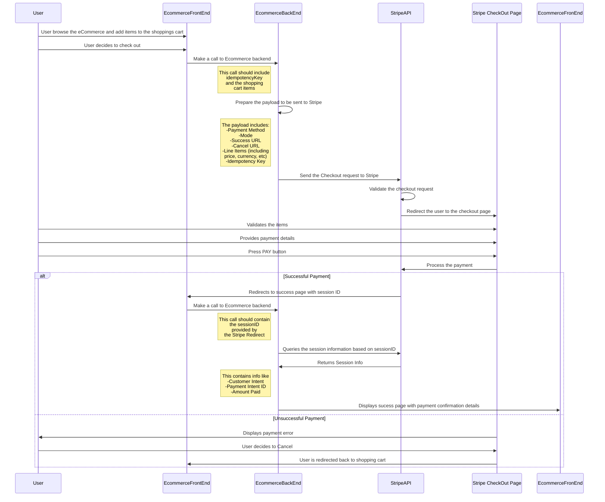

# Stripe Checkout - Ecommerce Integration

The purpose of this document is to explain how an Ecommerce website can easily start collecting payments using **Stripe**, specifically the **Stripe Checkout** feature.

**Note:** *It is not intended to demonstrate how to create a Ecommerce site with a shoppping cart. The sole intent of the project is to demonstrate the integration with Stripe.*

## Dev Stack
*	npm
*	FrontEnd
	*	JS Vue (SPA Framework)
	*	Webpack (Module Bundler)
*	BackEnd
	*	NodeJS
	*	Express (To Serve the server)

## Stripe functionality

Decided to use [Stripe's Checkout](https://stripe.com/en-au/payments/checkout) functionality. While it doesn't offer all the spectrum regarding customization (style or layout) its quite simple to implement and its by far the one that offers fastest speed to market.

If you want to have more control over the payments itself and/or the look and feel it's a good idea to use [Stripe's Elements](https://stripe.com/en-au/payments/elements) combined with [Stripe's JS](https://stripe.com/docs/stripe-js).  

## OpenSource code used

There are probably way too many products out there that serve as Ecommerce platform. In order to avoid reinventing the wheel I used an open source project for a very very simple VUE shopping cart. The project serves a very simple product catalog and a shopping cart and its intended to demonstrate how to use VUE

[Vue Cart](https://madewithvuejs.com/vue-cart)

## Prerequisite to understand and run the project

*	Have understanding of JS, HTML REST APIs
*	Having an account with [Stripe](https://www.stripe.com)
*	Collect the **Publishable key** and **Secret Key** from the *Developers* section of the Stripe's Dashboard

*	In order to test the integration a payment needs to be done. Please use the **[Stripe's Test Credit Cards](https://stripe.com/docs/testing)** and avoid using a real one.
*	Make sure Stripe is in test data mode to avoid any real charges, transactions or fees

* Understand the concept of [Idempotency](https://stripe.com/blog/idempotency). Its a quite simple math principle that can be used to guarantee your customers are not charged more than once per transaction (your customers and your PR team will thank you for it and Stripe makes it quite simple to implement). This is easily implemented in the project via a custom header.

## Getting the project ready to run

1. Insert in the config files your **Stripe's Keys**
2. Navigate to `/shop/frontend/` and execute 
	> npm install
	
3. Navigate to `/shop/backend/` and execute 
	> npm install
	
4. Replace Stripe's keys
	4.1	Rename the file `/shop/frontend/src/config_sample.js` to `/shop/frontend/src/config.js`
	4.2	Replace the value of *STRIPE_PUBLISHABLE_KEY* located in the file `/shop/frontend/src/config.js` for the one provided by your Stripe's account
	4.3 	Rename the file `/shop/backend/config_sample.js` to `/shop/backend/config.js`
	4.4	Replace the value of *STRIPE.SECRET_KEY* located in the file `/shop/backend/config.js` for the one provided by your Stripe's account
5. Run the Frontend and Backend
	5.1 **Frontend**: we are using *webpack* in order to load, compile and serve the VUE app. Webpack also adds a file-watcher that will guarantee saved changes to your source files will be automatically refreshed in your browser.
	Using a command-line terminal navigate to `/shop/frontend/` and execute `npm run dev`. You will need to leave that terminal window open in order to keep the server running. By default this will be running at `https://localhost:8000`
	5.2 **Backend:** we are using *nodemon* in order to load and serve the NodeJS using ExpressJS. ExpressJS also adds a file-watcher that will guarantee saved changes to your source files will be automatically refreshed in your server.
	Using a command-line terminal navigate to `/shop/backend/` and execute `npm run dev`. You will need to leave that terminal window open in order to keep the server running. By default this will be running at `https://localhost:5000`

The project is already setup to be running on the mentioned ports. This can be changed in the config files

## How does it work?

The user will browse the products catalog and add some items to the shopping cart. Once its ready to pay it will proceed to the *Checkout page* where all the items in the Shopping Cart can be viewed. From there the user decides to *Pay*; this will initiate the communication with stripe starting from 

1. Collecting the *Items* in the Shopping Cart
2. Generating an [Indempotent Key](https://stripe.com/docs/api/idempotent_requests)
3. Sending an AJAX request to the Ecommerce Backend

The EcommerceBackend will recieve the data, generate a payload following the format that [Stripe's Checkout API](https://stripe.com/en-au/payments/checkout) expects and sending the Checkout request using the [NodeJS Stripe's library](https://stripe.com/docs/api)

From there Stripe takes care of the process (assuming the request is valid) and redirects the user to a payment page where the user gets to check the items, the total amount to pay and finally gets to provide payment details.

Once the payment has been processed the user will be redirected back to the **Success URL** provided when calling Stripe. This redirect will also contain a *Session ID* that the Ecommerce site uses to pull information about the recent payment (amounts, payment intent ID, email, etc)

A detailed sequence diagram of the operation can be found next

If the user decides to cancel the payment the flow will be redirected to the *Cancel URL* specified before initiating the Checkout with Stripe

## Not covered by the demo

This is a basic implementation of a shopping cart intended to showcase the easiness of the integration with Stripe. 

The following items are not covered by the demo

*	Since its a SPA, the state of the shopping cart is not preserved after a *page reload* or a redirect outside of the Ecommerce site. This could be solved by storing the state of the shipping cart in a cookie or localstorage
